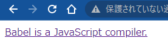

# babel/standaloneの使い方(あるいは、jsxをブラウザでコンパイルして表示)

## はじめに

* bableとは

  新しいバージョンの書き方で書いたJavascritpコードを古いバージョンでも動くように変換するツール。Node.js環境にインストールして利用する。

* babel/standaloneとは

  ブラウザーやその他の非Node.js環境で使用するためのbabel

  &lt;script&gt;タグで簡単に読み込んで使えます

## 基本的な使い方

* standalone版babelを読み込む
* `&lt;script type="text/babel"&gt; ～～ &lt;/script&gt;`に記載されたjsが自動的に変換＋実行される
* babelにコンパイルオプションを渡す場合は、`data-presets="～"`で渡すことができる(例：react 等)

sample1.html
```html
<!DOCTYPE html>
<head>
  <meta charset="utf-8">
  <title>babel/standalone/1</title>
  <script src="https://unpkg.com/@babel/standalone/babel.min.js"></script>
  <script type="text/babel">
    const getMessage = () => "Hello World";
    document.getElementById("app").innerText = getMessage();
  </script>
</head>
<body>
  <div id="app"></div>
</body>
</html>
```

* 単純に`Hello World`と表示されるだけのサンプルです

  


### 外部jsファイルを読み込んで変換する
* sample1.htmlのjavascriptを外部ファイルに保存して読み込む
* 外部jsファイルを読み込むので、Webサーバ経由で表示すること
  * `npx http-server`等で起動して表示

sample2.html
```html
<!DOCTYPE html>
<head>
  <meta charset="utf-8">
  <title>babel/standalone/1</title>
  <script src="https://unpkg.com/@babel/standalone/babel.min.js"></script>
  <script type="text/babel" src="sample2.js"></script>
</head>
<body>
  <div id="app"></div>
</body>
</html>
```

sample2.js
```js
const getMessage = () => "Hello World";
document.getElementById("app").innerText = getMessage();
```

### 文字列に格納したjavascriptを変換する

* 文字列に格納したjavascriptを`Babel.transform()`で変換する
* 変換オプションに`sourceType: "script"`を指定し`use strict`の出力を抑制する
  * eval()のスコープがローカルに制限されないようにするため (`document.getElementById("app")でdomが取得できなくなってしまう)`
* 変換後の`output`(ES5形式に変換されている)
```
var getMessage = function getMessage() {
  return "Hello World";
};
```

sample3.html
```html
<!DOCTYPE html>
<head>
  <meta charset="utf-8">
  <title>babel/standalone/1</title>
  <script src="https://unpkg.com/@babel/standalone/babel.min.js"></script>
</head>
<body>
  <div id="app"></div>
  <script>
    const input = `const getMessage = () => "Hello World";
                   document.getElementById("app").innerText = getMessage();`;
    const output = Babel.transform(input,
                                  { presets: ["env"],
                                    sourceType: "script"
                                  }).code;
    console.log(output);
    // strictモードの場合エラーになるため「sourceType: "script"」が必要
    eval(output);
  </script>
</body>
</html>
```

## 応用編

### jsxを変換する

* [presets: ["react"]](https://babeljs.io/docs/en/babel-preset-react) を指定してjsxを変換する

変換後ソース
  * React.createElement()に変換される(が、Reactを読み込んでいないため実行はしない(次で解説))
```javascript
/*#__PURE__*/React.createElement("a", {
  href: "https://babeljs.io/",
  target: "_blank"
}, "Babel is a JavaScript compiler.");
```


sample4.html
```html
<!DOCTYPE html>
<head>
  <meta charset="utf-8">
  <title>babel/standalone/1</title>
  <script src="https://unpkg.com/@babel/standalone/babel.min.js"></script>
</head>
<body>
  <div id="app"></div>
  <script>
    const input = `
    <a href="https://babeljs.io/" target="_blank">
      Babel is a JavaScript compiler.
    </a>`;
    const output = Babel.transform(input,{ presets: ["react"] }).code;
    console.log(output);
  </script>
</body>
</html>
```

### reactを読み込み、jsxを表示する

* reactを読み込む(umd版を読み込むことで、グローバル変数`React`に読み込まれる)
* `data-presets="react"`



sample5.html
```html
<!DOCTYPE html>
<head>
  <meta charset="utf-8">
  <title>babel/standalone/1</title>
  <script src="https://unpkg.com/@babel/standalone/babel.min.js"></script>
  <script src="https://unpkg.com/react@18/umd/react.development.js"></script>
  <script src="https://unpkg.com/react-dom@18/umd/react-dom.development.js"></script>
</head>
<body>
  <div id="app"></div>
  <script type="text/babel" data-presets="react">
    const Anchor = () => {
      return(
        <a href="https://babeljs.io/" target="_blank">
          Babel is a JavaScript compiler.
        </a>
      );
    }
    const root = ReactDOM.createRoot(document.getElementById('app'));
    root.render(<Anchor />);
  </script>
</body>
</html>
```


